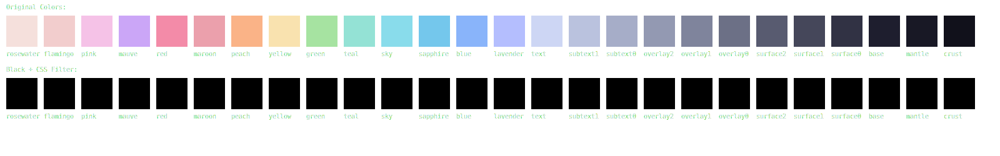

# CSS Filter Test - Mocha

## Using css_filter as a function

Red filter:
```css
invert(84%) sepia(12%) saturate(5940%) hue-rotate(294deg) brightness(97%) contrast(98%)
```

Green filter:
```css
invert(75%) sepia(52%) saturate(215%) hue-rotate(68deg) brightness(99%) contrast(98%)
```

Blue filter:
```css
invert(73%) sepia(86%) saturate(1931%) hue-rotate(186deg) brightness(100%) contrast(98%)
```

## Using css_filter as a pipe filter

Red:
```css
invert(84%) sepia(12%) saturate(5940%) hue-rotate(294deg) brightness(97%) contrast(98%)
```

Green:
```css
invert(75%) sepia(52%) saturate(215%) hue-rotate(68deg) brightness(99%) contrast(98%)
```

Blue:
```css
invert(73%) sepia(86%) saturate(1931%) hue-rotate(186deg) brightness(100%) contrast(98%)
```

## Multiple colors to verify caching

Rosewater:
```css
invert(92%) sepia(0%) saturate(125%) hue-rotate(132deg) brightness(97%) contrast(100%)
```

Flamingo:
```css
invert(95%) sepia(7%) saturate(2124%) hue-rotate(296deg) brightness(97%) contrast(95%)
```

Pink:
```css
invert(96%) sepia(68%) saturate(6962%) hue-rotate(190deg) brightness(96%) contrast(96%)
```

Mauve:
```css
invert(62%) sepia(67%) saturate(221%) hue-rotate(225deg) brightness(100%) contrast(99%)
```

## SVG Output


